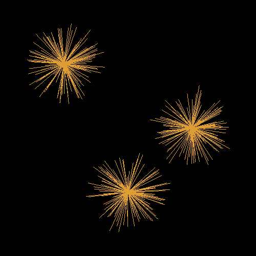

# Fireworks Project Report

Alexander Ahlbrandt

UAID: 010726372

## Problem Statement
Written in C++, this simple program uses openGL to draw a static image of what a firework may look like after explosion. There is no input, no error handling, and no output (other than the window displaying the fireworks).

## Design
This C++ program has three classes that define the structure of the program: Coordinate, LineSegment, Color, and Firework. There is a global vector of fireworks, and an array of coordinates for them to be placed at. The firework class is responsible for generating the destination coordinates, the line segments, and finally drawing them. The other classes serve as basic data structures. This allows me to make computations in an organized and consistent manner.

## Implementation
At the main method, the window is initialized for drawing. I define some coordinates to serve as the origin, then three fireworks are instantiated, centered with an origin. In the display method, the fireworks are drawn. The firework object has a draw method that draws each line segment from the origin to a calculated point on a sphere. The point may not be exactly on a sphere of a given radius - its magnitude and direction is random. The coordinates can be calculated with a simple mathematical formula. These points are computed in the object constructor. Equation reference available at https://en.wikipedia.org/wiki/Sphere. I started with no sample code, and it took me only a few short hours to complete.

## Testing
Due to the simplicity of this project, and the code being so static, there is not much to test. The only dynamic content in the program is the random number generator, and even those have a fixed, and safe range. I have ran the program tens of times, and there is no exceptional activity, and everything worked as expected.

Here are two images to show the variance at runtime:

Caputre0.png: 
Caputre1.png: 

## Conclusion
Overall, this project was a success. I created a realistic collection of fireworks comprised of line segments functioning as a spherical object. In the future, I would like to simulate a particle explosion, and drawn the particles path after a short amount of time. This would make it even more realistic because there would be curves to the firework. From research, to implementation, and submission, the project took about 6 hours to complete.